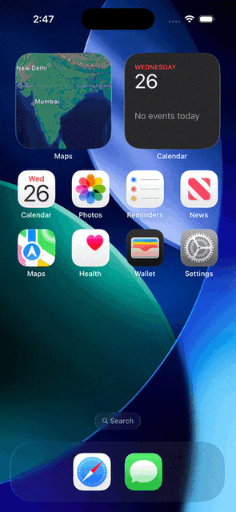

# WTH/R

yes it's a pun on weather and 'what the hell' (wth)

honest weather for people who hate checking the weather.

## why

i found weather apps boring. i got tired of robotic forecasts that just show numbers. i wanted an app to convey feelings and have a mood cuz who doesnt atp, it needs to have personality and not be the same boring thing

ik minimalism isnt the most personality inducing, but the messages make up for it i swear

## demo


## features

- accurate weather via open-meteo
- search for cities
- save locations (long press)
- dark mode support
- aggressively relatable commentary

## run it

either go to the deployed link: wth-r.vercel.app
clone the repo and do this:

```bash
npm install
npm run dev
```
if you want to run it on ios, with xcode:

```bash
npx cap open ios
```

built with react, vite, tailwind, & capacitor

stay cool & peace out
(._.)/